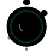

  

<h1 align="center">eSoup</h1>

  <strong>A collection of useful web tools for developers and sysadmins</strong> 
  <em>SSL monitoring, DNS checking, QR codes, DMARC reporting, and more</em>

  <a href="https://esoup.net">esoup.net</a> ·
  <a href="https://github.com/mcyork/esoup/discussions">Discussions</a> ·
  <a href="https://github.com/mcyork/esoup/issues/new/choose">Get Help</a>

---

## The Tools

<table>
  <tr>
    <td align="center" width="20%">
      <a href="https://sslurp.esoup.net">
         
        <strong>SSLurp</strong>
      </a> 
      SSL Certificate Checking
    </td>
    <td align="center" width="20%">
      <a href="https://box.esoup.net">
         
        <strong>Sipcode</strong>
      </a> 
      QR Code Service
    </td>
    <td align="center" width="20%">
      <a href="https://mailtaste.esoup.net">
         
        <strong>MailTaste</strong>
      </a> 
      DMARC Reporting
    </td>
    <td align="center" width="20%">
      <a href="https://dnslurp.esoup.net">
         
        <strong>DNSlurp</strong>
      </a> 
      DNS Monitoring
    </td>
  </tr>
</table>

---

## What's This Repo?

This is the **community hub** for all eSoup tools. No code lives here—just conversations, support, and collaboration.

### 💬 [Discussions](https://github.com/mcyork/esoup/discussions)

- **Ask questions** about any eSoup tool
- **Share ideas** for new features
- **Show off** what you've built
- **Get help** with setup or configuration

### 🎫 [Issues](https://github.com/mcyork/esoup/issues)

- **Report bugs** you've encountered
- **Request features** you'd like to see
- **Email recovery** if you've been unsubscribed

---

## Need Email Recovery?

Accidentally unsubscribed? Marked us as spam? Email bounced? No problem.

**[→ Request Email Recovery](https://github.com/mcyork/esoup/issues/new?template=email-recovery.yml)**

We'll get you back on the list. The process is quick:
1. Open the recovery request (link above)
2. Check the consent box and pick your services
3. Click the link the bot posts to send us an email
4. We'll unsuppress you and reply when it's done

---

## About the Wax Seals

Each eSoup tool has its own wax seal logo:

| Tool | Color | Symbol | Meaning |
|------|-------|--------|---------|
| **SSLurp** | 🔴 Red | Checkmark | Certificate validation |
| **Sipcode** | 🟣 Indigo | QR Pattern | Code scanning |
| **MailTaste** | 🟣 Purple | Envelope | Email/DMARC |
| **DNSlurp** | 🔵 Blue | Magnifying glass | DNS inspection |
| **eSoup** | 🟢 Green | Bowl & ladle | The whole soup |

---

## Links

| Tool | URL | What it does |
|------|-----|--------------|
| **eSoup** | [esoup.net](https://esoup.net) | Hub & subscription management |
| **SSLurp** | [sslurp.esoup.net](https://sslurp.esoup.net) | Check SSL certificates |
| **Sipcode** | [box.esoup.net](https://box.esoup.net) | Generate & track QR codes |
| **MailTaste** | [mailtaste.esoup.net](https://mailtaste.esoup.net) | Parse & visualize DMARC reports |
| **DNSlurp** | [dnslurp.esoup.net](https://dnslurp.esoup.net) | Monitor DNS record changes |

---

## Managing Your Email Preferences

Visit **[esoup.net/unsubscribe](https://esoup.net/unsubscribe)** (link from any eSoup email) to:

- ✅ Subscribe/unsubscribe from individual product updates
- 🚫 Unsubscribe from all notification emails
- ⛔ Block ALL emails (nuclear option—even transactional)

---

  Made with ☕ by <a href="https://github.com/mcyork">@mcyork</a>

